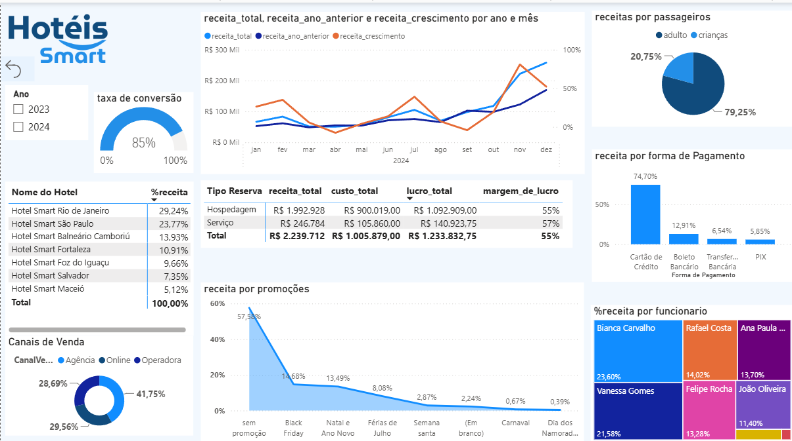

# analise-rede-hoteleira
Projeto de análise de dados e Business Intelligence aplicado ao setor hoteleiro utilizando Power BI
# 🏨 Análise de Dados de Rede Hoteleira

Projeto de **Análise de Dados e Business Intelligence** aplicado ao setor hoteleiro, desenvolvido durante meus estudos de **Power BI**.

O objetivo do projeto foi transformar diferentes bases de dados em informações visuais e indicadores capazes de apoiar a análise do desempenho de uma rede de hotéis.

---

## 📊 Dashboard



---

## 🎯 Objetivo do Projeto

Desenvolver um dashboard interativo para analisar o desempenho de uma rede hoteleira, consolidando informações de diferentes fontes e permitindo uma visão mais clara dos principais indicadores do negócio.

Durante o desenvolvimento foram trabalhados conceitos de:

- Tratamento e organização de dados
- Relacionamento entre diferentes tabelas
- Modelagem de dados
- Criação de medidas e indicadores
- Construção de visualizações
- Análise de desempenho e resultados
- Business Intelligence aplicado à tomada de decisão

---

## 📈 Indicadores Analisados

O dashboard permite acompanhar informações como:

- Receita total
- Receita do ano anterior
- Crescimento da receita
- Lucro total
- Margem de lucro
- Taxa de conversão
- Receita por hotel
- Receita por forma de pagamento
- Receita por canal de venda
- Receita por promoções
- Participação de adultos e crianças
- Receita por funcionário

---

## 🛠️ Tecnologias e Ferramentas

- **Power BI**
- **Power Query**
- **DAX**
- **Excel**
- **Modelagem de Dados**
- **GitHub**

---

## 📂 Estrutura do Repositório

```text
analise-rede-hoteleira/
│
├── dados/
│   ├── vendas/
│   └── bases utilizadas na análise
│
├── dashboard/
│   └── Dashboard_final.pbix
│
├── imagens/
│   └── dashboard-principal.png
│
└── README.md

🧠 Aprendizados

Este projeto foi importante para colocar em prática conceitos estudados em Business Intelligence, principalmente na transformação de dados brutos em informações mais claras e úteis para análise.

Também permitiu desenvolver minha compreensão sobre modelagem de dados, criação de indicadores, construção de dashboards e organização de um projeto de dados de forma estruturada.

Além da parte técnica, a publicação deste projeto no GitHub faz parte da construção do meu portfólio e da minha transição profissional para a área de Dados e Business Intelligence.

🚀 Próximos Passos

Continuar evoluindo meus conhecimentos em:

SQL
Python
Power BI
DAX
Modelagem de Dados
Análise de Dados

E desenvolver novos projetos que integrem essas tecnologias na solução de problemas reais.

👨‍💻 Autor

Iago Vito Batista

Estudante de Análise e Desenvolvimento de Sistemas
Foco em Dados | Business Intelligence | SQL | Python | Power BI
